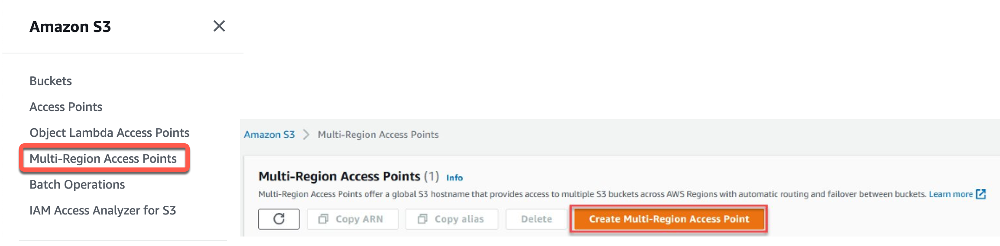
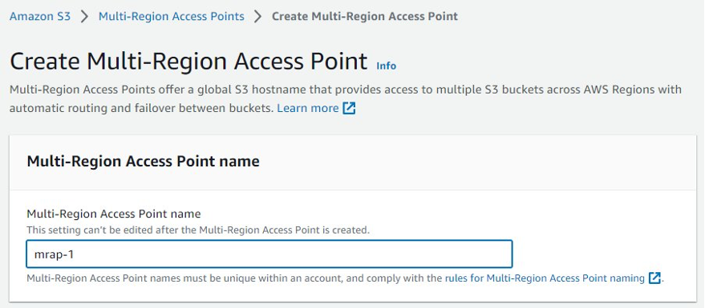
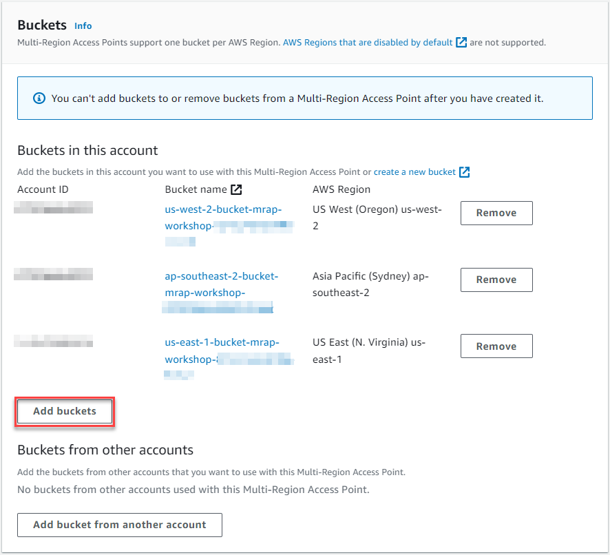
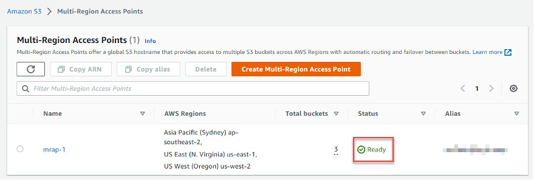

# Amazon S3 Multi-Region Access Points

Amazon S3 Multi-Region Access Points provide a global endpoint for routing Amazon S3 request traffic between AWS Regions. This feature simplifies network configurations by allowing traffic from multiple sources—such as Amazon Virtual Private Clouds (VPCs), on-premises data centers over AWS PrivateLink, and the public internet—to be routed through a single endpoint.

## Key Benefits

- **Accelerated Performance**: Internet-sourced Amazon S3 requests routed through Multi-Region Access Points can experience up to 60% faster performance compared to traditional routing over the public internet.
- **High Availability**: Build highly available, multi-Region applications with a simple architecture, ensuring seamless operation worldwide.
- **Failover Controls**: Operate in active-passive or active-active configurations and control the shift of S3 data access traffic between AWS Regions. During a regional disruption, failover can be managed within minutes.

## Use Cases

- Enhance global application performance by reducing latency and improving data access speeds.
- Ensure high availability and resilience of applications by leveraging multiple AWS Regions.
- Simplify network management with a single, global endpoint for diverse traffic sources.

## What I Did

In this project, I set up and utilized Amazon Simple Storage Service (Amazon S3) Multi-Region Access Points and failover controls. Through this process, I enabled access to data stored in these buckets via a single global endpoint and conducted failover testing between any two active-passive Region pairs. Specifically, I completed the following tasks:

  - [1. Created Amazon S3 buckets](#1-created-amazon-s3-buckets)
  - [2. Established an S3 Multi-Region Access Point](#2-established-an-s3-multi-region-access-point)
  - [3. Configured bi-directional S3 Replication](#3-configured-bi-directional-s3-replication)
  - [4. Managed traffic redirection](#4-managed-traffic-redirection)
  - [5. Delegated access control](#5-delegated-access-control)
  - [6. Accessed my Multi-Region Access Point using the AWS CLI](#6-accessed-my-multi-region-access-point-using-the-aws-cli)
  - [7. Utilizing a VPC endpoint](#7-utilizing-a-vpc-endpoint)
  - [8. Monitored S3 Replication](#8-monitored-s3-replication)
  - [9. Cleanup Resources](#9-cleanup-resources)

## 1. Created Amazon S3 buckets

### A - Sign in to the AWS Management console and open the Amazon S3 console.

- Sign in to the AWS Management console and open the Amazon S3 console.
  

### B - Create an Amazon S3 bucket

- In the Amazon S3 left-hand navigation, select Buckets. Then, select Create bucket.
  

### C - Name and AWS Region

- For Bucket name, enter a descriptive DNS compliant name, taking note of the supported AWS Regions for Multi-Region Access Points. We recommend that you include the region in the name.
- For AWS Region, select the Region you want your bucket to be created in.
  

### D - Object Ownership

- For Object Ownership, select ACLs disabled, so that access to the bucket and its objects is specified using only bucket policies. Starting in April 2023, ACLs will be automatically disabled for all new S3 buckets by default.
  

### E - Block Public Access

- For Block Public Access settings for this bucket, keep the default selection Block all public access.
  

### F - Bucket Versioning

- For Bucket Versioning, select Disable.
  - Bucket versioning is a requirement for S3 Replication. By leaving it disabled you will see later how the replication setup process handles this.
  - Optionally, add a bucket tag to help track costs associated with a workload. AWS uses the bucket tags to organize your resource costs on your cost allocation report, to make it easier for you to categorize and track your AWS costs. For more information, see [Using Cost Allocation Tags](https://docs.aws.amazon.com/awsaccountbilling/latest/aboutv2/cost-alloc-tags.html) in the AWS Billing User Guide.
  

### G - Default encryption

- For Default encryption, select Amazon S3-managed keys (SSE-S3).
  - The settings here will apply to any objects uploaded to the bucket where you have not defined different at-rest encryption details during the upload process.
  - If your encryption requirements are not satisfied by SSE-S3, you can also leverage AWS Key Management Service (AWS KMS). However, for the purposes of this guide, select SSE-S3 as this will allow you to set up replication rules from within the Multi-Region Access point. For more information about how Amazon S3 uses AWS KMS, see the [AWS Key Management Service Developer Guide](https://docs.aws.amazon.com/kms/latest/developerguide/).
  

### H - Advanced settings

- For Advanced settings, leave the default settings.
- Then, select Create bucket.
  

### I - Create at least one more S3 bucket

- Repeat steps 1.2 through 1.8 to create at least one more S3 bucket to add to your S3 Multi-Region Access Point. Each bucket must be in a different AWS Region. You can add one bucket per AWS Region in up to 17 separate AWS Regions to a single S3 Multi-Region Access Point.

## 2. Established an S3 Multi-Region Access Point

### 2.1 - Create an S3 Multi-Region Access Point

- Navigate to the Amazon S3 console.
- In the left-hand navigation, choose Multi-Region Access Points.
- Then, select Create Multi-Region Access Point.

### 2.2 - Name your access point and add buckets

- Enter a name for your access point.
  - Each access point needs a name, unique within each account. This name is only for administration, not data access.
  

### 2.3 - Add your previously created buckets

- Select Add buckets, and choose the buckets you created in Step 1.
  - Notes: 
    - You can add new or existing buckets to a new Multi-Region Access Point, but no more than one per Region, and you can’t add remove buckets from a Multi-Region Access Point after it’s created.
    - The recommended setting of Block all Public Access is enabled by default.
    - You can also add buckets from other accounts. Read this blog for more details.
    

### 2.4- Complete creation

- Select Create Multi-Region Access Point.
  - Note: Multi-Region Access Points typically take less than 10 minutes to create, depending on the number of buckets, but can take up to 24 hours.
- Wait for its status to show as Ready before proceeding. Refresh the list to see the updated status.

## 3. Configured bi-directional S3 Replication

### 3.1 - View access point properties

    Select the name of your Multi-Region Access Point to configure additional settings.
    Each access point has an automatically-generated and globally unique alias, and an Amazon Resource Name (ARN). The alias will look like a random string ending with .mrap – for example, mmqdt41e4bf6x.mrap. The ARN has the format arn:aws:s3::<account-id>:accesspoint/<alias> and is typically used for data access.
    Copy the ARN to a notepad, you will need it later.

### 3.2 - Configure replication using the built-in templates

    From the properties of your new Multi Region Access Point, select the Replication and failover tab.

### 3.3 - Replication and failover overview map

    The Replication and failover overview (Replication) map shows the AWS Regions of the buckets that you added to the Multi-Region Access Point. The lack of arrows shows that S3 Cross-Region Replication has not yet been configured.

### 3.4 - Create replication rules

    Choose Replication rules and select Create replication rules.

### 3.5 - Replication templates

    On the Choose template page, there are two template options available, one-way and two-way (also known as full mesh). Two-way replication is recommended with Multi-Region Access Points, as objects can be written to any bucket.
    Choose the Replicate objects among all specified buckets template.

### 3.6 - Enable bucket versioning

    Note: Because you didn't enable Bucket Versioning on the previously created buckets, a warning is displayed as Versioning is required for replication. The Multi-Region Access Point console makes it easy to enable this.
    Select all the included buckets and choose Enable Bucket Versioning. All the buckets will change to Enabled in the Bucket Versioning column.

### 3.7 - Replication scope

    For Replication rule configuration, verify that it is Enabled. 
    For Scope, choose Apply to all objects in the bucket.
        You can apply S3 Replication to particular prefixes (or folders) in an Amazon S3 bucket. It is typical to have all data replicated so that all clients see the same data regardless of location, though you may have a use-case where it is appropriate for buckets accessed via a Multi-Region Access Point to have differing data.

### 3.8 - Additional replication options

    For Additional replication options, choose the following options:
        Replication Time Control (RTC) - optional
        Delete marker replication
        Replica modification sync
    Review the Learn more links for more information about these capabilities.

Notes:

    To fully synchronize the contents of your replicated data, you should enable the replication of deletion markers and metadata changes on your objects between your replicated buckets.
    To be notified of any replication failures and monitor your replication progress including the amount of data yet to be replicated, the number of objects remaining to be replicated, and the latency of replication, we recommend that you enable Replication metrics and notifications (they need to be enabled for module 8 of this guide).  
    To obtain an SLA of completing replication for 99.9% of all new objects within 15 minutes, which can help meet compliance or business requirements, enable S3 Replication Time Control.

### 3.9 - Create replication rules

    Then, select Create replication rules.
    After a few seconds the replication rules (one per bucket, per direction) should be successfully created. Once this is complete, select Close.

### 3.10 - Replication and failover overview map

    Review the Replication and failover overview (Replication) map, it should now show two-way replication between your S3 buckets.

### 3.11 - Upload an object to one of your buckets

    In the Amazon S3 console left-hand navigation, open Buckets in a new browser tab. Then, select the name of one of the buckets that you previously created.
    Under the Objects tab, select Upload.
    Add a file from your computer.
        This should be no more than a few megabytes, and not contain any sensitive information. For the purposes of this guide, you do not need to change any of the defaults.
    Select Upload. 

Note: Most new objects complete replication in seconds to minutes to all of the destination buckets.

## 4. Managed traffic redirection

<!-- Add your content here for managing traffic redirection -->

## 5. Delegated access control

<!-- Add your content here for delegating access control -->

## 6. Accessed my Multi-Region Access Point using the AWS CLI

<!-- Add your content here for accessing the Multi-Region Access Point using the AWS CLI -->

## 7. Utilizing a VPC endpoint

<!-- Add your content here for utilizing a VPC endpoint -->

## 8. Monitored S3 Replication

<!-- Add your content here for monitoring S3 Replication -->

## 9. Cleanup Resources

<!-- Add your content here for cleaning up resources -->
