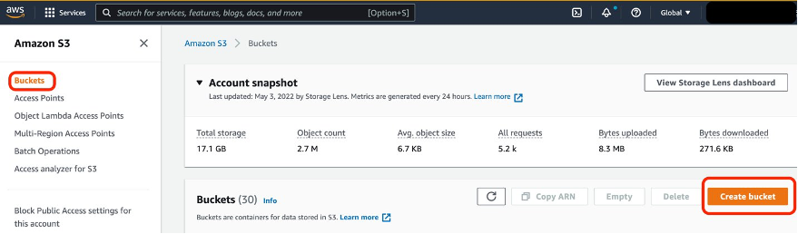
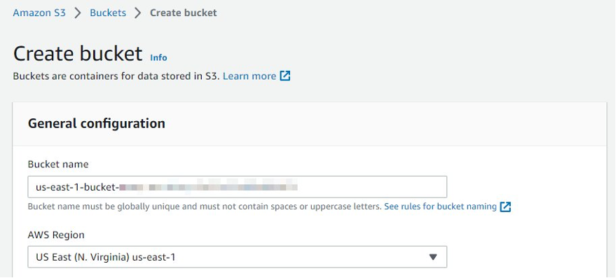
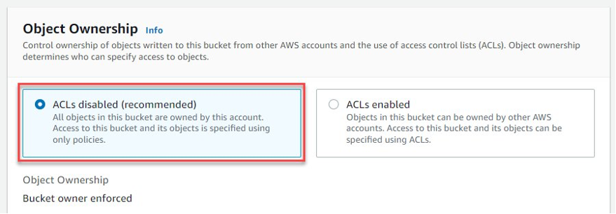
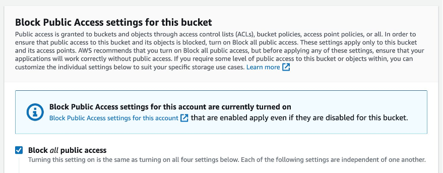
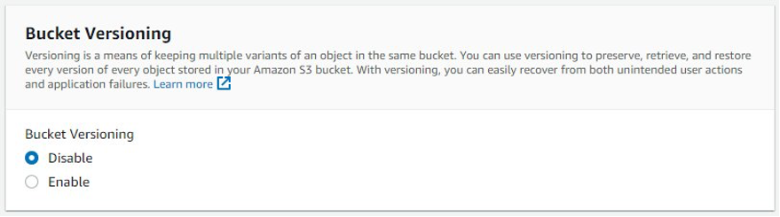
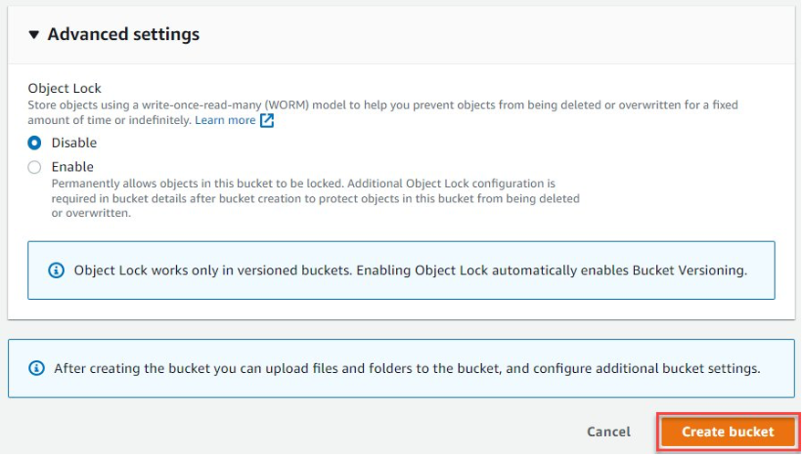

# Amazon S3 Multi-Region Access Points

Amazon S3 Multi-Region Access Points provide a global endpoint for routing Amazon S3 request traffic between AWS Regions. This feature simplifies network configurations by allowing traffic from multiple sources—such as Amazon Virtual Private Clouds (VPCs), on-premises data centers over AWS PrivateLink, and the public internet—to be routed through a single endpoint.

## Key Benefits

- **Accelerated Performance**: Internet-sourced Amazon S3 requests routed through Multi-Region Access Points can experience up to 60% faster performance compared to traditional routing over the public internet.
- **High Availability**: Build highly available, multi-Region applications with a simple architecture, ensuring seamless operation worldwide.
- **Failover Controls**: Operate in active-passive or active-active configurations and control the shift of S3 data access traffic between AWS Regions. During a regional disruption, failover can be managed within minutes.

## Use Cases

- Enhance global application performance by reducing latency and improving data access speeds.
- Ensure high availability and resilience of applications by leveraging multiple AWS Regions.
- Simplify network management with a single, global endpoint for diverse traffic sources.

## What I Did

In this project, I set up and utilized Amazon Simple Storage Service (Amazon S3) Multi-Region Access Points and failover controls. Through this process, I enabled access to data stored in these buckets via a single global endpoint and conducted failover testing between any two active-passive Region pairs. Specifically, I completed the following tasks:

  - [1. Created Amazon S3 buckets](#1-created-amazon-s3-buckets)
  - [2. Established an S3 Multi-Region Access Point](#2-established-an-s3-multi-region-access-point)
  - [3. Configured bi-directional S3 Replication](#3-configured-bi-directional-s3-replication)
  - [4. Managed traffic redirection](#4-managed-traffic-redirection)
  - [5. Delegated access control](#5-delegated-access-control)
  - [6. Accessed my Multi-Region Access Point using the AWS CLI](#6-accessed-my-multi-region-access-point-using-the-aws-cli)
  - [7. Utilizing a VPC endpoint](#7-utilizing-a-vpc-endpoint)
  - [8. Monitored S3 Replication](#8-monitored-s3-replication)
  - [9. Cleanup Resources](#9-cleanup-resources)

## 1. Created Amazon S3 buckets

### A - Sign in to the AWS Management console and open the Amazon S3 console.

- Sign in to the AWS Management console and open the Amazon S3 console.
  

### B - Create an Amazon S3 bucket

- In the Amazon S3 left-hand navigation, select Buckets. Then, select Create bucket.
  

### C - Name and AWS Region

- For Bucket name, enter a descriptive DNS compliant name, taking note of the supported AWS Regions for Multi-Region Access Points. We recommend that you include the region in the name.
- For AWS Region, select the Region you want your bucket to be created in.
  

### D - Object Ownership

- For Object Ownership, select ACLs disabled, so that access to the bucket and its objects is specified using only bucket policies. Starting in April 2023, ACLs will be automatically disabled for all new S3 buckets by default.
  

### E - Block Public Access

- For Block Public Access settings for this bucket, keep the default selection Block all public access.
  

### F - Bucket Versioning

- For Bucket Versioning, select Disable.
  - Bucket versioning is a requirement for S3 Replication. By leaving it disabled you will see later how the replication setup process handles this.
  - Optionally, add a bucket tag to help track costs associated with a workload. AWS uses the bucket tags to organize your resource costs on your cost allocation report, to make it easier for you to categorize and track your AWS costs. For more information, see [Using Cost Allocation Tags](https://docs.aws.amazon.com/awsaccountbilling/latest/aboutv2/cost-alloc-tags.html) in the AWS Billing User Guide.
  

### G - Default encryption

- For Default encryption, select Amazon S3-managed keys (SSE-S3).
  - The settings here will apply to any objects uploaded to the bucket where you have not defined different at-rest encryption details during the upload process.
  - If your encryption requirements are not satisfied by SSE-S3, you can also leverage AWS Key Management Service (AWS KMS). However, for the purposes of this guide, select SSE-S3 as this will allow you to set up replication rules from within the Multi-Region Access point. For more information about how Amazon S3 uses AWS KMS, see the [AWS Key Management Service Developer Guide](https://docs.aws.amazon.com/kms/latest/developerguide/).
  

### H - Advanced settings

- For Advanced settings, leave the default settings.
- Then, select Create bucket.
  

### I - Create at least one more S3 bucket

- Repeat steps 1.2 through 1.8 to create at least one more S3 bucket to add to your S3 Multi-Region Access Point. Each bucket must be in a different AWS Region. You can add one bucket per AWS Region in up to 17 separate AWS Regions to a single S3 Multi-Region Access Point.

## 2. Established an S3 Multi-Region Access Point

<!-- Add your content here for establishing an S3 Multi-Region Access Point -->

## 3. Configured bi-directional S3 Replication

<!-- Add your content here for configuring bi-directional S3 Replication -->

## 4. Managed traffic redirection

<!-- Add your content here for managing traffic redirection -->

## 5. Delegated access control

<!-- Add your content here for delegating access control -->

## 6. Accessed my Multi-Region Access Point using the AWS CLI

<!-- Add your content here for accessing the Multi-Region Access Point using the AWS CLI -->

## 7. Utilizing a VPC endpoint

<!-- Add your content here for utilizing a VPC endpoint -->

## 8. Monitored S3 Replication

<!-- Add your content here for monitoring S3 Replication -->

## 9. Cleanup Resources

<!-- Add your content here for cleaning up resources -->
