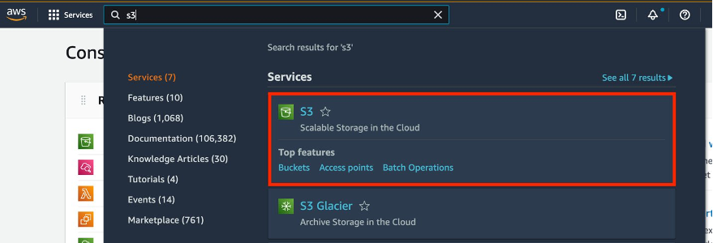

# Amazon S3 Multi-Region Access Points

Amazon S3 Multi-Region Access Points provide a global endpoint for routing Amazon S3 request traffic between AWS Regions. This feature simplifies network configurations by allowing traffic from multiple sources—such as Amazon Virtual Private Clouds (VPCs), on-premises data centers over AWS PrivateLink, and the public internet—to be routed through a single endpoint.

## Key Benefits

- **Accelerated Performance**: Internet-sourced Amazon S3 requests routed through Multi-Region Access Points can experience up to 60% faster performance compared to traditional routing over the public internet.
- **High Availability**: Build highly available, multi-Region applications with a simple architecture, ensuring seamless operation worldwide.
- **Failover Controls**: Operate in active-passive or active-active configurations and control the shift of S3 data access traffic between AWS Regions. During a regional disruption, failover can be managed within minutes.

## Use Cases

- Enhance global application performance by reducing latency and improving data access speeds.
- Ensure high availability and resilience of applications by leveraging multiple AWS Regions.
- Simplify network management with a single, global endpoint for diverse traffic sources.

## What I Did

In this project, I set up and utilized Amazon Simple Storage Service (Amazon S3) Multi-Region Access Points and failover controls. Through this process, I enabled access to data stored in these buckets via a single global endpoint and conducted failover testing between any two active-passive Region pairs. Specifically, I completed the following tasks:

- Created Amazon S3 buckets
- Established an S3 Multi-Region Access Point and associated my buckets with it
- Configured bi-directional S3 Replication
- Managed traffic redirection by designating Regions as active and passive, and conducted failover in under 2 minutes
- Delegated access control for my buckets to the access point
- Accessed my Multi-Region Access Point using the AWS CLI
- Understood the importance and methods of utilizing a VPC endpoint for accessing S3 Multi-Region Access Points
- Monitored S3 Replication progress and request metrics.

#### 1. Create an Amazon S3 bucket

- 

  
In the Amazon S3 left-hand navigation, select Buckets. Then, select Create bucket.

  

